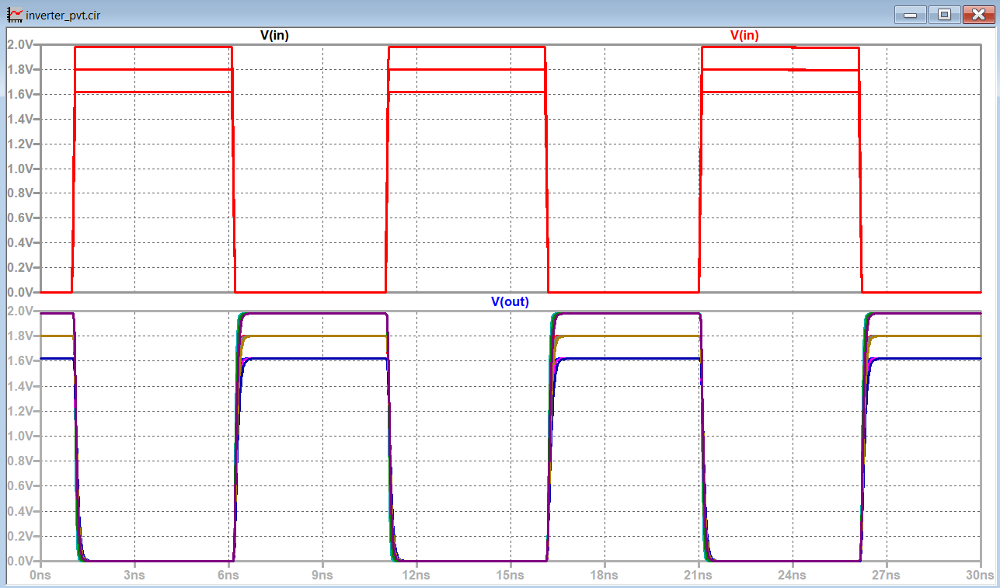
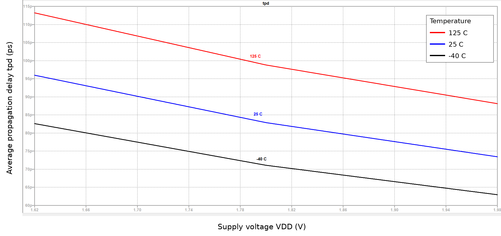

# CMOS Inverter PVT Corner Analysis (LTspice)

Simulation of a CMOS inverter across supply voltage and temperature corners, measuring how propagation delay changes at each corner.

## Setup
- Tool: LTspice
- Circuit: CMOS inverter, 50 fF load, generic Level-1 MOSFET models (illustrative, not a real process)
- Corners: VDD = 1.62 V, 1.8 V, 1.98 V; temperature = -40 C, 25 C, 125 C (9 runs)
- Measured: tpHL, tpLH and average propagation delay (tpd) at VDD/2 crossings

## Results
| VDD (V) | Temp (C) | tpHL (ps) | tpLH (ps) | tpd (ps) |
|---|---|---|---|---|
| 1.62 | -40 | 78.3 | 87.0 | 82.6 |
| 1.80 | -40 | 67.6 | 74.5 | 71.1 |
| 1.98 | -40 | 60.1 | 65.8 | 63.0 |
| 1.62 | 25 | 91.7 | 100.3 | 96.0 |
| 1.80 | 25 | 79.3 | 86.4 | 82.9 |
| 1.98 | 25 | 70.4 | 76.5 | 73.4 |
| 1.62 | 125 | 109.9 | 116.5 | 113.2 |
| 1.80 | 125 | 95.8 | 101.9 | 98.8 |
| 1.98 | 125 | 85.4 | 90.9 | 88.1 |

 *Input and output waveforms with all 9 corners overlaid (3 VDD values x 3 temperatures).*

## Analysis
- **Worst-case corner:** VDD = 1.62 V, 125 C (tpd = 113.2 ps), about 37% slower than nominal (1.8 V, 25 C: 82.9 ps).
- **Best-case corner:** VDD = 1.98 V, -40 C (tpd = 63.0 ps), about 24% faster than nominal.
- **Why:** A lower supply voltage reduces gate overdrive, so the transistors deliver less drive current into the load capacitance. A higher temperature lowers carrier mobility, which cuts the current further, so delay is largest at low VDD and high temperature.
- **Observation:** tpLH is about 9-10% larger than tpHL at every corner, so the pull-up is slightly weaker than the pull-down with the current 2.5:1 PMOS/NMOS width ratio.

- ## Debugging: rise/fall delay imbalance
**Symptom:** In the baseline, tpLH was 6-11% larger than tpHL at every corner (at 1.8 V, 25 C: 86.4 ps vs 79.3 ps).
**Hypothesis:** The PMOS is under-sized. Its mobility parameter is about 2.8x lower than the NMOS, but the width ratio was only 2.5.
**Fix:** Increased PMOS width from 2.5 um to 2.8 um (`inverter_pvt_fixed.cir`).

| Metric (1.8 V, 25 C) | Before (Wp = 2.5 um) | After (Wp = 2.8 um) |
|---|---|---|
| tpHL (ps) | 79.3 | 79.3 |
| tpLH (ps) | 86.4 | 80.0 |
| tpLH vs tpHL | +9.0% | +0.8% |
| tpd (ps) | 82.9 | 79.6 |

**Result:** The imbalance at nominal dropped from 9.0% to 0.8%, and across all 9 corners from 6-11% to within about ±3%. The balance shifts with temperature: at 125 C tpLH ends up 2-3% below tpHL, so one width cannot balance every corner. I did not investigate the cause.

## Run it yourself
Open `inverter_pvt.cir` in LTspice and run the simulation. Press Ctrl+L to see the .meas results.

## Limitations
Generic Level-1 models are used (LTspice warns that the W and L are small for this model level), so absolute values are not representative of a real process; the trends are the useful result.
